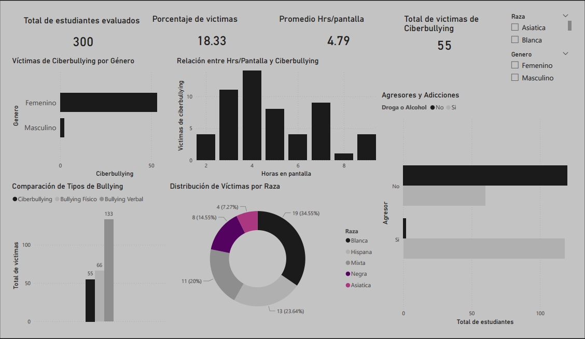
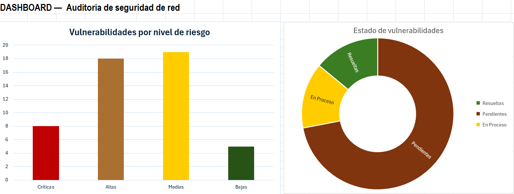

# 🔐 Auditoría y Gestión de Seguridad de Redes
### Análisis de Vulnerabilidades — Reporte en Excel

---
## 🖼️ Vista Previa

**Dashboard de vulnerabilidades:**


---
## 📋 Descripción del Proyecto

Reporte de auditoría de seguridad desarrollado en **Microsoft Excel** simulando un análisis real de vulnerabilidades en la infraestructura de red de una organización. El proyecto aplica conceptos de la **ISO 27001** para identificar, clasificar y documentar vulnerabilidades por nivel de riesgo y estado de resolución.

El inventario cubre **100 dispositivos** de red con **50 vulnerabilidades** identificadas entre switches, servidores, cámaras IP, workstations y dispositivos de red.

---

## 🛠️ Tecnologías Utilizadas

| Herramienta | Uso |
|-------------|-----|
| Microsoft Excel | Desarrollo del reporte completo |
| Fórmulas avanzadas (COUNTIF, COUNTA) | Cálculo automático de métricas |
| Gráficos Excel | Visualización del dashboard |
| ISO 27001 | Marco de referencia para clasificación de riesgos |

---

## 📂 Estructura del Reporte

El archivo contiene 4 hojas:

| Hoja | Descripción |
|------|-------------|
| `Inventario` | 100 dispositivos de red con IP, SO, tipo y ubicación |
| `Vulnerabilidades` | 50 vulnerabilidades con nivel de riesgo y estado |
| `Resumen` | Métricas calculadas automáticamente con fórmulas |
| `Dashboard` | Gráficas visuales del análisis |

---

## 📐 Fórmulas Utilizadas

```excel
-- Vulnerabilidades en total
=COUNTA(Vulnerabilidades!A2:A1000)

-- Vulnerabilidades por nivel de riesgo
=COUNTIF(Vulnerabilidades!E2:E1000,"Crítico")
=COUNTIF(Vulnerabilidades!E2:E1000,"Alto")
=COUNTIF(Vulnerabilidades!E2:E1000,"Medio")
=COUNTIF(Vulnerabilidades!E2:E1000,"Bajo")

-- Estado de resolución de vulnerabilidades
=COUNTIF(Vulnerabilidades!F2:F1000,"Resuelto")
=COUNTIF(Vulnerabilidades!F2:F1000,"Pendiente")
=COUNTIF(Vulnerabilidades!F2:F1000,"En Proceso")
```

---

## 📈 Hallazgos Principales

| Indicador | Resultado |
|-----------|-----------|
| Total dispositivos inventariados | 100 |
| Total vulnerabilidades identificadas | 50 |
| Vulnerabilidades Críticas | 8 (16%) |
| Vulnerabilidades Altas | 18 (36%) |
| Vulnerabilidades Medias | 19 (38%) |
| Vulnerabilidades Bajas | 5 (10%) |
| Resueltas | 7 (14%) |
| Pendientes | 36 (72%) |
| En Proceso | 7 (14%) |

### 🔍 Hallazgos Críticos

- 🔴 **Windows 7 y Windows Server 2012** sin soporte activo — riesgo crítico inmediato
- 🔴 **Cámaras IP con credenciales de fábrica** — acceso no autorizado a video vigilancia
- 🔴 **NAS sin autenticación** — datos de respaldo expuestos en red interna
- 🔴 **Bases de datos sin cifrado en backups** — fuga de información sensible
- 🟠 **72% de vulnerabilidades pendientes** — capacidad de resolución insuficiente

---
## 🖼️ Vista Previa del resumen

**Resumen ejecutivo:**


---

## 🗂️ Estructura del Proyecto

```
auditoria-seguridad-red/
├── auditoria_red.xlsx    # Reporte completo Excel
├── preview2.png          # Dashboard
├── preview1.png          # Resumen ejecutivo
└── README.md             # Documentación
```

---

## 👩‍💻 Autora

**Paula Martinez**  
Estudiante de Ingeniería en Ciencia de Datos — UNICDA  
📧 martinezpaula0728@gmail.com  
📍 Santo Domingo, República Dominicana
